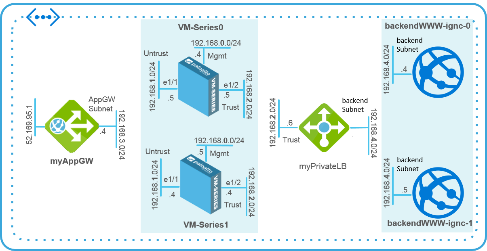

# Using VM-Series Firewalls and the Azure Application Gateway to Secure Internet-Facing Web Workloads
This ARM template deploys two VM-Series firewalls between a pair of Azure load balancers. The external load balancer is an Azure Application Gateway (a web load balancer) that also serves as the Internet facing gateway, which  receives traffic and distributes it to the VM-Series firewalls. The firewalls enforce security policies to protect your workloads, and send the allowed traffic to the internal load balancer which is an Azure Load Balancer (Layer 4) that load balances across a pair of sample Apache web servers. 


As demand for your web services increase, you can add more web servers and deploy additional VM-Series firewalls for more capacity. Each tier, the VM-Series firewalls and web servers, are deployed in separate Availability Sets for higher availability and redundancy against planned and unplanned outages. Refer to Azure documentation for more information on [Availability Sets](https://docs.microsoft.com/en-us/azure/virtual-machines/virtual-machines-linux-manage-availability). A sample configuration file for VM-Series firewall is also included. After you import this configuration file, be sure to (a) customize the security policies to your needs and (b) <b>set a custom password</b> for the firewall instead of the value in the sample file. Refer to the documentation for steps on how to import the sample configuration file. 

 
 

**Documentation**
* Release Notes: Included in this repository.
* Technical Documentation:[VM-Series Deployment Guide](https://www.paloaltonetworks.com/documentation/71/virtualization/virtualization/set-up-the-vm-series-firewall-in-azure/deploy-the-vm-series-and-azure-application-gateway-template.html)
* About the [VM-Series Firewall for Azure](https://azure.paloaltonetworks.com)

[](https://portal.azure.com/#create/Microsoft.Template/uri/https%3A%2F%2Fraw.githubusercontent.com%2FIrekRomaniuk%2Fazure%2Fmaster%2Fpan-applicationgateway%2Fazuredeploy.json)

[Deploy the Template to Azure](https://www.paloaltonetworks.com/documentation/80/virtualization/virtualization/set-up-the-vm-series-firewall-on-azure/deploy-the-vm-series-and-azure-application-gateway-template/start-using-the-vm-series--azure-application-gateway-template/deploy-the-template-to-azure#id2d3b5321-8303-4995-be66-c26522cf2074)
Note the Public IP address or the DNS name assigned to eth0-VM-Series0 and eth0-VM-Series1 to access the management interface of the VM-Series firewalls.
You can either configure the firewall manually or import the Sample Configuration File appgw-sample.xml provided in the GitHub repository and customize it for your security needs.


https://panfwmgmt0.eastus.cloudapp.azure.com 
$ ssh -i .ssh/id_rsa panfwmgmt0.eastus.cloudapp.azure.com
https://panfwmgmt1.eastus.cloudapp.azure.com
$ ssh -i .ssh/id_rsa panfwmgmt1.eastus.cloudapp.azure.com


http://panappgw.eastus.cloudapp.azure.com

```
jumpserver
$ ssh -i .ssh/id_rsa  paloalto@x.x.x.x 
netadmin1a
$ ssh paloalto@192.168.5.4
```

```
rg='panlab-apg'
dp='panlabDeployment'
az login
az group create --name panlab-apg --location "East US"
az group deployment create \
  --name panlabDeployment \
  --resource-group panlab-apg \
  --template-file azuredeploy.json \
  --parameters @azureDeploy.parameters.json \
  --parameters sshPublicKey=
az vm show \
    --resource-group panlab-apg \
    --name panlabDeployment \
    --show-details \
    --query publicIps \
    --output tsv  
az group deployment show --resource-group panlab-apg --name panlabDeployment    
az group delete --name panlab-apg    
```

NSG: 162.248.249.0/24,72.195.150.25,209.160.129.0/24


az vm create \
    --resource-group $rg \
    --name netadmin1a \
    --os-type linux --image UbuntuLTS \
    --admin-username paloalto \
    --vnet vnet-FW
    --subnet jumpSubnet
    --authentication-type password
    --admin-password --no-wait

az vm create \
    --resource-group $rg \
    --name jump \
    --os-type linux --image UbuntuLTS \
    --admin-username paloalto \
    --vnet vnet-FW
    --subnet transitSubnet
    --public-ip-address-dns-name jumpserver
    --ssh-key-value 

